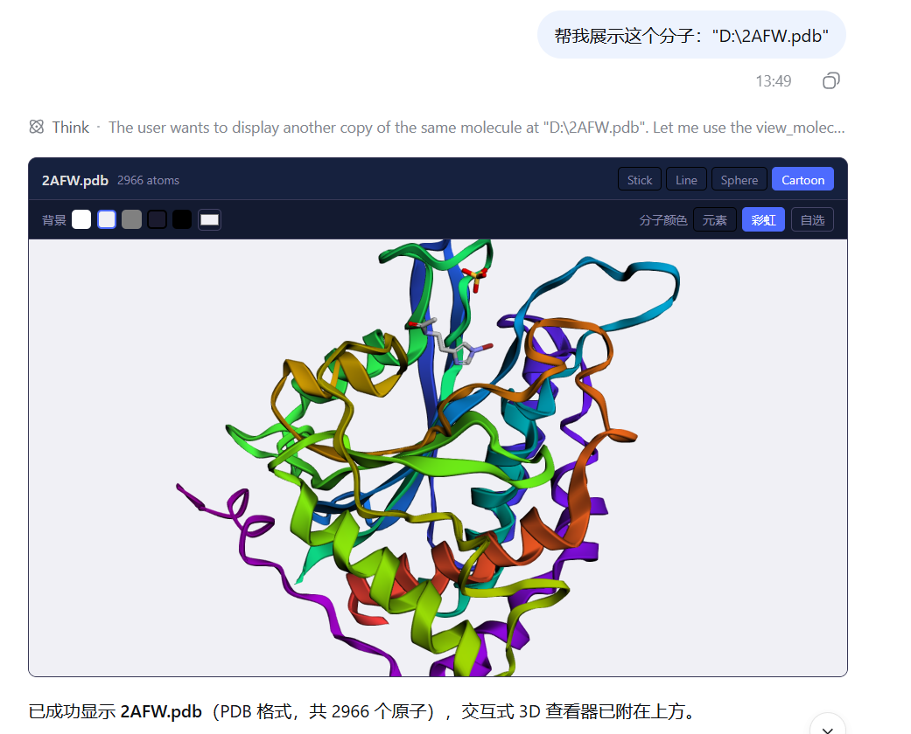

# dsh-molecule-viewer

English | [简体中文](README.md)

An interactive 3D molecule viewer plugin for DSH (DeepSeek Harness): pass a molecular file path or PDB/SDF/MOL2/MOL data, and an **interactive 3D viewer** (3Dmol.js — rotate/zoom, style switching, coloring) renders right in the conversation.



## Features

- 🧬 **Four formats**: PDB (proteins/large molecules), SDF, MOL2, MOL
- 📁 **Path-first**: pass the file path and the tool reads it server-side — Windows (`D:\dir\x.pdb`), WSL (`/mnt/d/dir/x.pdb`), and `~/` spellings are recognized and cross-converted automatically
- 🖱️ **Interactive viewer**: rotate, zoom, and switch cartoon / stick / line / sphere styles, background color, and molecule coloring live
- 🔄 **Survives restarts**: the viewer payload persists with the `tool/result` event and re-renders when history is reloaded (official slots only — installs on a stock harness)
- ⚡ **Lightweight parsing**: the host side only counts atoms and validates; real parsing and rendering happen in the browser via 3Dmol.js
- 📦 **3Dmol.js bundled locally**: `vendor/3Dmol-min.cjs` (2.4.2) is compiled into the client bundle at build time — no CDN requests at runtime, fast loads, works offline, immune to tracking-prevention blocks

## Install

```bash
dsh plugin --profile web add git+https://github.com/PandaAIDD/dsh-molecule-viewer.git
```

Restart to activate:

```bash
dsh --profile web
```

After installation the `view_molecule` tool is available automatically; the model calls it based on its description.

> `dsh plugin` is a pnpm forwarder: clone the repo → install into the profile's `node_modules` → detect the `dsh.bundle.patch` declaration → add it to `dsh.profile.bundles` automatically. peerDependencies resolve from the profile's healed `node_modules`.

## Usage

Just describe what you want in the conversation and the model calls the tool:

> "Visualize this molecule: D:\project\Dock\data\3IPQ.pdb"

Or be explicit:

> "Use the view_molecule tool to view this SDF data: ..."

### Supported formats

| Format | Extensions | Notes |
|---|---|---|
| PDB | `.pdb` `.ent` | Proteins/large molecules (ATOM/HETATM records) |
| SDF | `.sdf` `.sd` | Multi-molecule structures (V2000/V3000) |
| MOL2 | `.mol2` | TRIPOS format |
| MOL | `.mol` | MDL MOL (V2000/V3000) |

> SMILES is not supported yet — a format with 3D coordinates is required.
>
> Molecular content above 2 MB is not inlined into the session log; the viewer slot shows a summary card instead (atom count and format remain visible).

### Tool parameters

| Parameter | Type | Required | Description |
|---|---|---|---|
| `path` | `string` | one of `path`/`data` (**preferred**) | Path to the molecular file, exactly as the user wrote it (Windows/WSL both work, `~/` expands); read server-side, fast |
| `data` | `string` | one of `path`/`data` | Raw molecular file content as plain text — only for molecules with no file on disk (e.g. pasted in chat); do not base64-encode |
| `format` | `pdb \| sdf \| mol2 \| mol` | required with `data` | Input format; inferred from the extension when `path` is given, may be omitted |
| `name` | `string` | no | Display name (e.g. "1CRN"), shown as the viewer title |
| `style` | `stick \| line \| sphere \| cartoon` | no | Initial rendering style (default `stick`; `cartoon` recommended for proteins) |

## Development

```bash
# Install dependencies (or reuse the DSH profile's node_modules)
pnpm install

# Build (artifacts are committed to GitHub; users installing need no build)
pnpm run build

# Type check
pnpm run typecheck
```

### Project layout

```
dsh-molecule-viewer/
├── package.json          # declares dsh.bundle + dsh.client
├── cordis.patch.yml      # bundle patch: inserts the plugin row by package name
├── tsconfig.json
├── src/
│   ├── index.ts          # host half: registers the view_molecule tool (path/data dual entry)
│   ├── parser.ts         # lightweight parser (atom counting + validation)
│   ├── types.ts          # shared types (incl. the presentationMeta payload contract)
│   ├── invariant.ts      # package-invariant companion
│   └── client/
│       ├── index.ts      # client half: registers the tool.call.toolview keyed renderer
│       ├── MoleculeView.tsx    # interactive 3Dmol.js container
│       ├── contract/types.ts   # wire-contract mirror + runtime guard
│       └── threeDmol.ts  # locally bundled 3Dmol.js loader (vendor, no CDN)
├── vendor/                # bundled 3Dmol.js 2.4.2 (.cjs — UMD build)
├── lib/                  # build artifacts (committed to the repo)
├── assets/               # screenshots and doc resources
└── README.md
```

### Architecture

```
Model calls view_molecule(path or data)
    ↓
Host half (Node.js): read/receive molecule → parse & count → presentationMeta payload (data + style)
    ↓                        (persisted with the tool/result event — a first-class harness event type)
Client half (browser): block.meta payload → tool.call.toolview renderer → interactive 3Dmol.js view
```

> **Why no custom session events?** Version 0.1.0 drove the client via a custom `molecule/view` session event, but the harness's persistence read path refuses logs containing event types that are "unknown and not marked `ignorable`" — and the public `Session.append()` API cannot set that marker. The result: on any **stock harness**, sessions containing viewer calls could not be reloaded after a restart (`SessionFormatUnsupportedError`). As of 0.2.0 the plugin uses the `presentationMeta` + `tool.call.toolview` official slots instead: the payload persists with the `tool/result` event and replays on reload, so viewers keep rendering after restarts and the plugin installs on any stock harness.

## License

MIT
